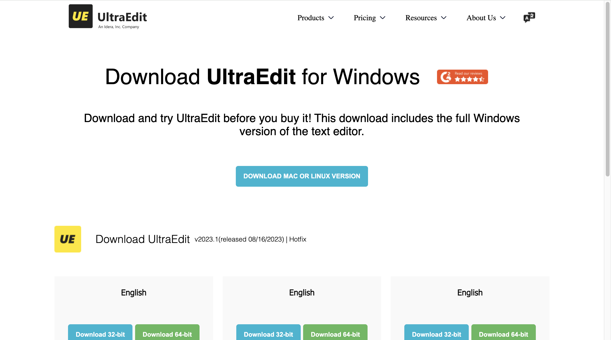
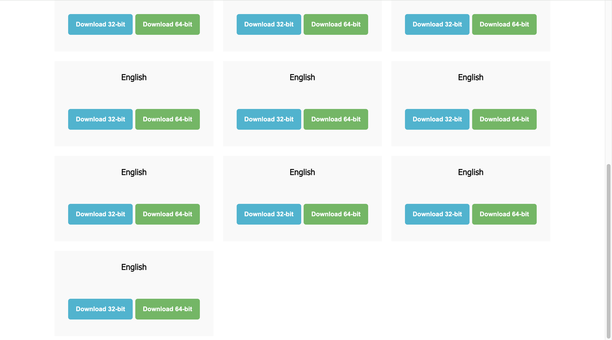

# UltraEdit Clone 🔥

This project is a **clone of the UltraEdit website landing page**, built using **HTML** and **CSS** only.  
It is fully responsive and designed to closely match the original UltraEdit site look and feel.

## 🚀 Features

- Clean and modern UI
- Responsive design
- Hover effects
- Smooth layout structure
- Pixel-perfect UltraEdit clone

## 📸 Screenshots

### Top Section:



### Bottom Section:



## 🛠️ Built With

- HTML5
- CSS3

## 📂 How to Run

1. Clone the repository
2. Open `index.html` in your browser

```bash
git clone https://github.com/GunSinghal/UltraEdit-Clone.git
```
